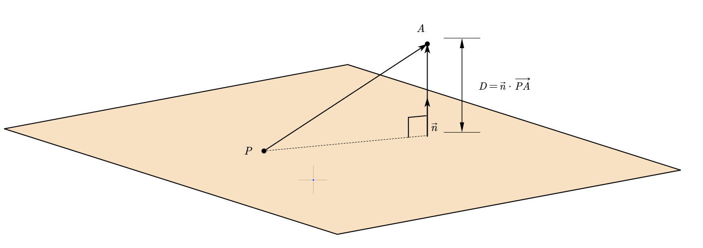
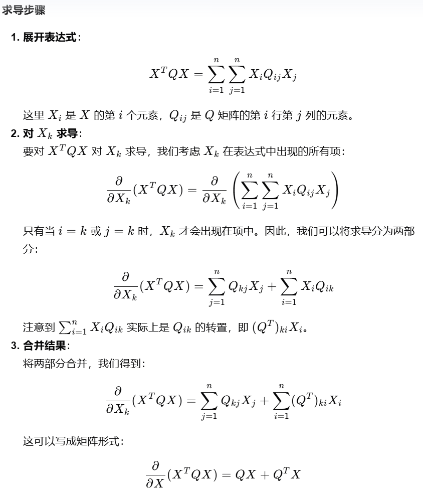
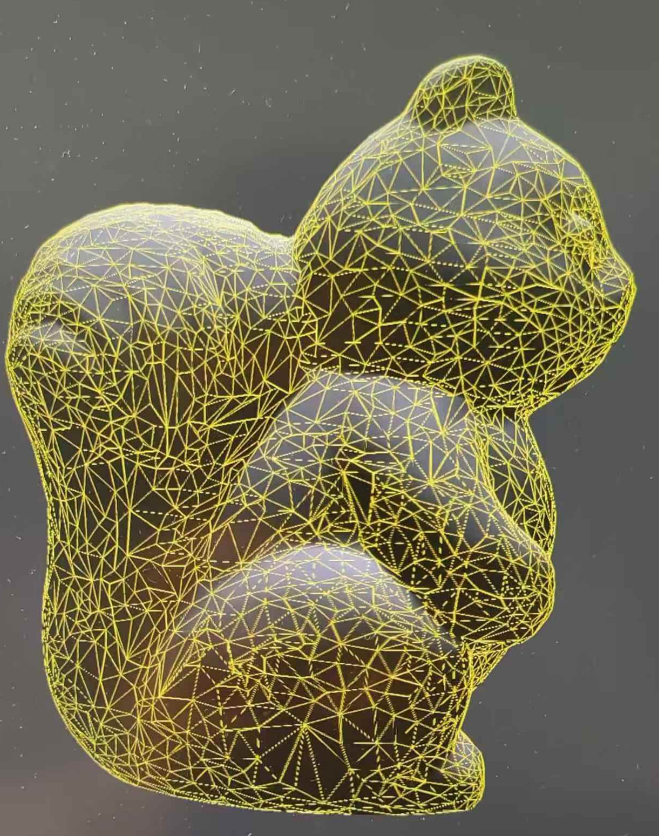
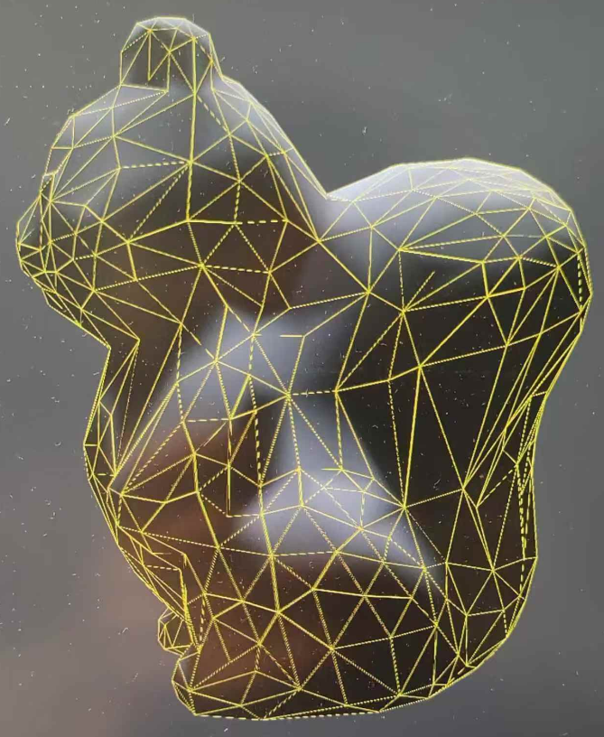

# QEM经典网格简化算法实验报告

## Q矩阵的含义和求法：

算法中的cost是由新的顶点到其周围面的距离平方和来衡量的，Q矩阵就出现在cost的表达式中，具体得到Q的表达式的过程如下：

若已知：

- 点$A(x,y,z)$
- 面$F_1$:$a_1x+b_1y+c_1z+d_1=0$
- $F_1$上一点$P(x_0,y_0,z_0)$

根据这些可以求出$d_1=-a_1x_0-b_1y_0-c_1z_0$,后面会用到

$A$到$F1$的距离:
$D_1=a_1(x-x_0)+b_1(y-y_0)+c_1(z-z_0)$
($D_1=\vec{n}\cdot\overrightarrow{PA},\vec{n}$需要归一化)

$$
\begin{aligned}
D_1^2&=(a_1(x-x_0)+b_1(y-y_0)+c_1(z-z_0))^2\\
	&=(a_1x+b_1y+c_1z+d_1*1)^2\\
	&=([a_1,b_1,c_1,d_1]\cdot[x,y,z,1]^T)^2\\
	&=[x,y,z,1]\cdot([a_1,b_1,c_1,d_1]^T\cdot[a_1,b_1,c_1,d_1])\cdot[x,y,z,1]^T\\
	&=X^T\cdot Q_1\cdot X
	\end{aligned}
$$

$$
X=[x,y,z,1]^T
$$

$$
Q_1=[a_1,b_1,c_1,d_1]^T\cdot[a_1,b_1,c_1,d_1]\\
=\begin{bmatrix}
a_1a_1&a_1b_1&a_1c_1&a_1d_1\\
a_1b_1&b_1b_1&b_1c_1&b_1d_1\\
a_1c_1&b_1c_1&c_1c_1&c_1d_1\\
a_1d_1&b_1d_1&c_1d_1&d_1d_1\\
\end{bmatrix}
$$

这其中的计算处理需要注意的是

- 把$x_0,y_0,z_0$用$d_1$替换掉了
- 如果$X$是三维向量，$D_1^2$就无法被看作二次型（即只有二次项的表达式），所以多引入一个值恒为1的维度，可以使表达式非常简洁，这个和之前平移矩阵的道理差不多，多引入一个维度可以化简表达式

## Q矩阵的相加是什么意思

与上面同理，如果有另一个面$F_2$

则A到$F_2$距离的平方$D_2^2=X^T\cdot Q_2\cdot X$

A到$F1$和$F2$距离的平方和$D_1^2+D_2^2=X^T\cdot (Q_1+Q_2)\cdot X$

所以Q矩阵本来直接对应的是平面，有了平面的Q矩阵可以很方便地计算出某点到该平面的距离的平方

顶点对应的矩阵Q就是将其周围的平面的Q矩阵相加，有了顶点的Q矩阵可以很方便地计算出某点到该顶点周围所有面的距离的平方和

==综上所述，使用Q矩阵只是为了方便地求算出点到若干个面的距离平方和，Q矩阵的相加表示的是，计算平方和的时候将更多的平面纳入进来==

## 如何求解cost的最小值，找到最佳顶点位置：

#### 如何知道cost的极小值就是最小值，以及如何判断cost是否有极小值

设新顶点的坐标为$X=[x,y,z,1]^T$，

$cost=X^T\cdot Q\cdot X$

如果Q是一个正定矩阵，说明cost一定有最小值，但是在这里

由于$Q可以化成\vec{N}\cdot\vec{N}^T$,也就是化成$\vec{N}\cdot I\cdot\vec{N}^T$,也就是说$Q$与$I$相合，所以$Q$是正定的，cost存在唯一极小值点也就是最小值点

#### 求解极小值点

有方程
$$
\begin{cases}
\dfrac{dcost}{dx}=0\\
\dfrac{dcost}{dy}=0\\
\dfrac{dcost}{dz}=0\\
\end{cases}
$$
论文中说这个方程组等价于
$$
\begin{bmatrix}
q_{11}&q_{12}&q_{13}&q_{14}\\
q_{12}&q_{22}&q_{23}&q_{24}\\
q_{13}&q_{23}&q_{33}&q_{34}\\
0&0&0&1\\
\end{bmatrix}\cdot X=
\begin{bmatrix}
0\\0\\0\\1
\end{bmatrix}
$$
 乍一看可能感到疑惑，如果直接不用矩阵表示，把这些东西全部用解析式表示可能最后发现确实是等价的，但是如何快速理解这两者是等价呢？或者如果让我们自己转化问题，如何将上面的三个方程转化成矩阵表示呢？

这里其实可以用一个公式：
$$
\dfrac{\partial}{\partial X}(X^TQX)=QX+Q^TX
$$
AI给出的证明如下：

我们这里Q是对称矩阵，所以得到方程：
$$
2QX=[0,0,0,1]^T
$$
 如果我们想要使用这个公式，其实需要四个方程，而我们只有三个。

我们可以人为加上一个方程，只要始终保持等号左右两边相等就可以了，论文中的等价其实就是加上了一个最简单的方程： $0*x+0*y+0*z+1*1=1$

其实第四行完全可以换成其它数字，比如：
$$
\begin{bmatrix}
q_{11}&q_{12}&q_{13}&q_{14}\\
q_{12}&q_{22}&q_{23}&q_{24}\\
q_{13}&q_{23}&q_{33}&q_{34}\\
0&0&0&5\\
\end{bmatrix}\cdot X=
\begin{bmatrix}
0\\0\\0\\5
\end{bmatrix}
$$
 当然为了使方程与x，y，z无关,前三个数字需要保持为0.

 将方程写为矩阵之后，问题就变成了求解这个矩阵的逆，然后可以得到新顶点的最佳位置。

## 求解新顶点最佳位置时，矩阵不可逆说明了什么

矩阵不可逆的情况困扰了我们，因为这样就无法通过矩阵求逆来计算新顶点的最佳位置，然后我们似乎就“被迫”使用比较粗糙的办法。

但是矩阵不可逆其实恰恰说明的时是，使cost达到最小值的顶点位置有无数多个。

比如这种情况：要合并的两个顶点周围的所有面片从坐标上看都同属于一个平面，此时，我们在这个大平面上选择任意一个点作为新的顶点，都可以使得cost为最小值0，求出来的矩阵自然是不可逆的。

## 具体算法：

### 第一步：求解每个顶点的Q矩阵

- 求解每个面的Q矩阵

- 双层循环，外层遍历每个顶点，内层遍历顶点的所有连接面，累加得到每个顶点的Q矩阵

### 第二步：构建邻接表和优先队列

- 构建邻接表：写一个buildAdjacencyList函数来构建邻接表，具体算法是遍历每个面的三条边，使边的的两个顶点互为键值，记录在adjacency_list中
- 构建优先队列：使用邻接表不重复地遍历每条边，创建Edge实例，计算新的顶点坐标，记录到Edge的new_V中，计算cost，如果变换矩阵可逆，算出新坐标，如果不可逆，直接将second作为新坐标，是否可逆记录在Edge实例的inver布尔值中，然后把Edge给push到优先队列中。（注意优先队列默认从大到小排列，需要写一个自定义比较函数）

### 第三步：在while循环中迭代合并顶点，跳出条件是网格面数小于预期面数

- 取出优先队列中的最小项
- 更新second顶点的坐标
- 判断是否为有效边（可能其中的顶点在迭代过程中被删除）
- 删去first顶点
- 更新面数组：遍历first顶点的相邻面，将这些面的first顶点改为second顶点，
- 删除面：面的三个顶点有重合的去除，面总数减一
- 更新邻接表和cost：遍历first所有相邻点，将这些点与second连接，创建Edge实例，计算新顶点和cost，push到优先队列
- 更新faces_of_vertices数组：遍历first点相邻面，push到second相邻面中

## 写代码过程遇到的问题

- 开始没有更新faces_of_vertices数组，在load函数中数组越界
- 将三维向量扩展到四维向量的时候没有用对格式，出现神秘报错
- 一次性简化太多会导致简化速度很慢乃至卡死，将ratio调至0.95之后简化得非常丝滑

## 效果展示

[Ctrl+点击打开可执行文件](可执行文件/mesh-simplification.exe)

